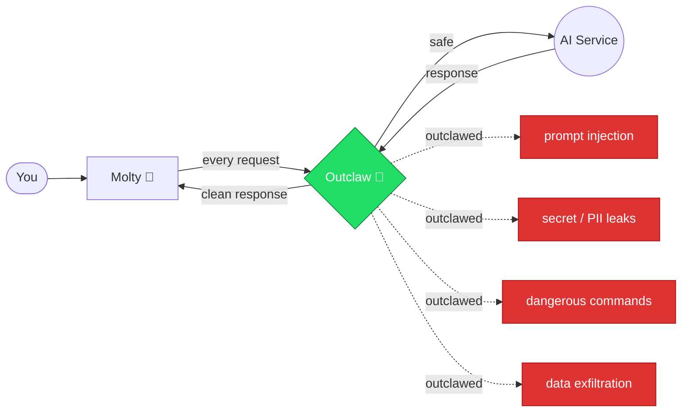

# How it works

Outclaw runs as a local proxy that inspects all traffic between Molty and the AI service. Each protection is a guardrail that inspects traffic before it reaches the AI (pre-call) and after the AI responds (post-call).

## The six guards

| Guard | Approach |
|---|---|
| Tool Guard | Pattern matching against 17+ known dangerous command signatures |
| Workspace Guard | Path resolution — detects directory traversal and system path access |
| Network Guard | Domain allowlist/blocklist + [Tranco](https://tranco-list.eu/) top 10,000 sites |
| Secret Guard | [detect-secrets](https://github.com/Yelp/detect-secrets) (25+ detectors) + regex patterns |
| PII Guard | [Presidio](https://github.com/microsoft/presidio) named entity recognition (30+ PII types) |
| ML Guard | [LlamaFirewall](https://github.com/meta-llama/llama-firewall) (PromptGuard 2) for prompt injection detection |
